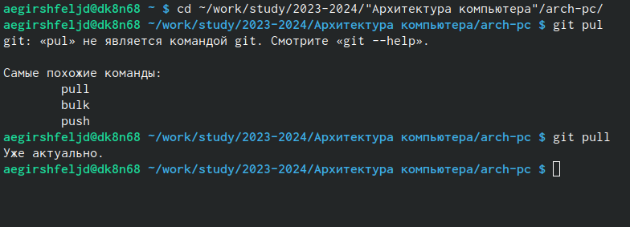
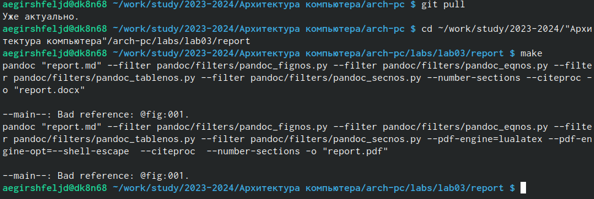
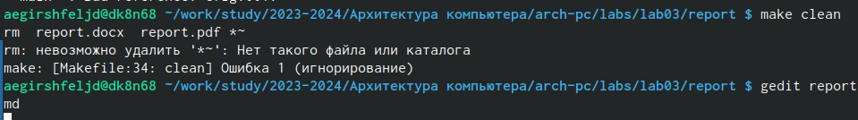
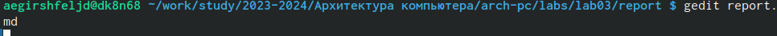
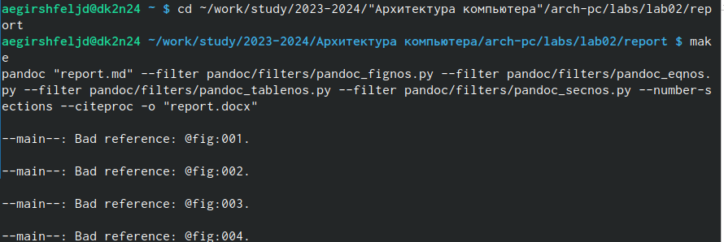
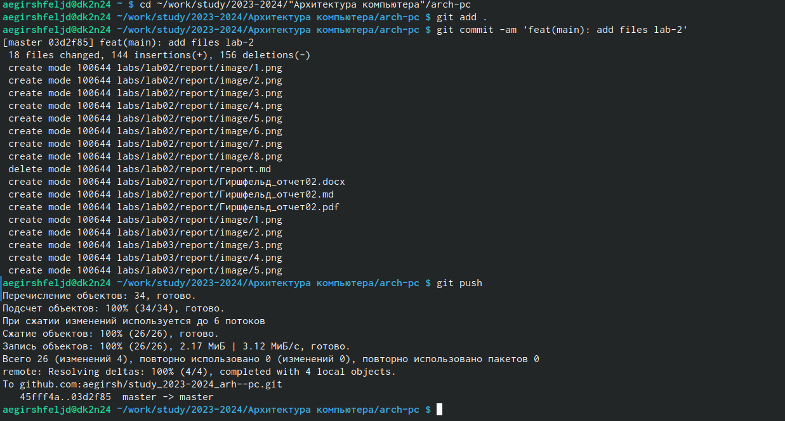

---
## Front matter
title: "отчёт по лабораторной работе 3"
subtitle: "Дисципоина: архитектура компьютера"
author: "Гиршфельд А.Е"

## Generic otions
lang: ru-RU
toc-title: "Содержание"

## Bibliography
bibliography: bib/cite.bib
csl: pandoc/csl/gost-r-7-0-5-2008-numeric.csl

## Pdf output format
toc: true # Table of contents
toc-depth: 2
lof: true # List of figures
lot: true # List of tables
fontsize: 12pt
linestretch: 1.5
papersize: a4
documentclass: scrreprt
## I18n polyglossia
polyglossia-lang:
  name: russian
  options:
	- spelling=modern
	- babelshorthands=true
polyglossia-otherlangs:
  name: english
## I18n babel
babel-lang: russian
babel-otherlangs: english
## Fonts
mainfont: PT Serif
romanfont: PT Serif
sansfont: PT Sans
monofont: PT Mono
mainfontoptions: Ligatures=TeX
romanfontoptions: Ligatures=TeX
sansfontoptions: Ligatures=TeX,Scale=MatchLowercase
monofontoptions: Scale=MatchLowercase,Scale=0.9
## Biblatex
biblatex: true
biblio-style: "gost-numeric"
biblatexoptions:
  - parentracker=true
  - backend=biber
  - hyperref=auto
  - language=auto
  - autolang=other*
  - citestyle=gost-numeric
## Pandoc-crossref LaTeX customization
figureTitle: "Рис."
tableTitle: "Таблица"
listingTitle: "Листинг"
lofTitle: "Список иллюстраций"
lotTitle: "Список таблиц"
lolTitle: "Листинги"
## Misc options
indent: true
header-includes:
  - \usepackage{indentfirst}
  - \usepackage{float} # keep figures where there are in the text
  - \floatplacement{figure}{H} # keep figures where there are in the text
---

# Цель работы

Целью данной лабораторной работы является ознакомления и освоение процедуры оформления отчетов в легковесном языке раметки markdown

# Выполнение лабораторной работы

я открыл терминал и перешел в каталог arch-pc и при помощи команды git pull обновил данный репозитори(рис.[-@fig:001 width=70%]}
{#fig:001 width=70%}

провожу компеляцию шаблона и проверяю (рис.[-@fig:002 width=70%]}
{#fig:002 width=70%}

удаляю полученные файлы (рис.[-@fig:003 width=70%]}
{#fig:003 width=70%}

Открыл файл report.md c помощью текстого редактора (рис.[-@fig:004 width=70%]}
{#fig:004 width=70%}

заполнил отчет и скоприрывал его при помощи makefile. и он есть во всех нужных форматах

Задание для самостоятельной работы

В соответствующем каталоге сделал отчёт по лабораторной работе № 2 в формате
Markdown в 3 форматах: pdf, docx
и md.{#fig:004 width=70%}

и Загрузил файлы на github{#fig:004 width=70%}
# Выводы

я знаю как теперь делать отчеты с помощью лековесного языка разметки markdown

