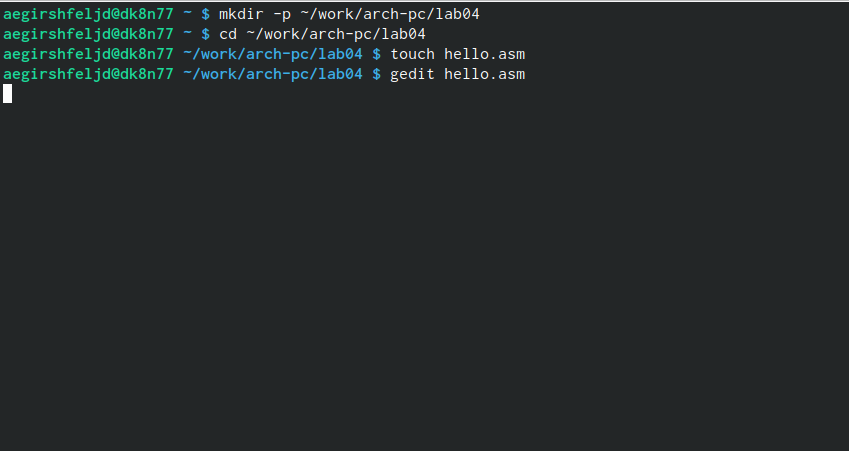
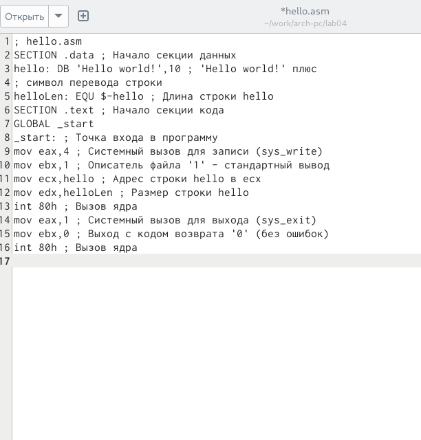
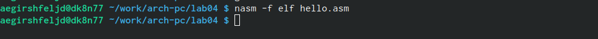
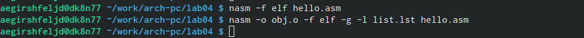
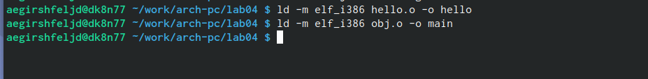
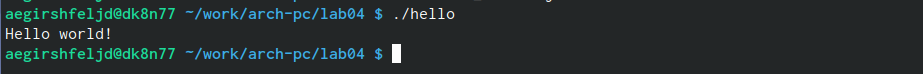
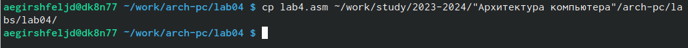
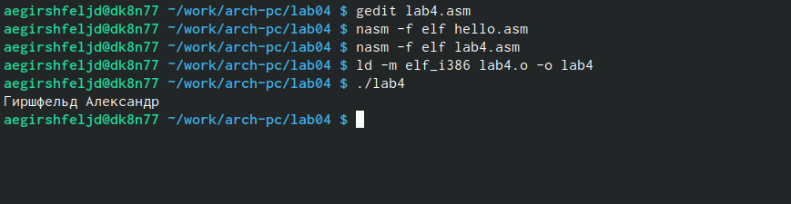
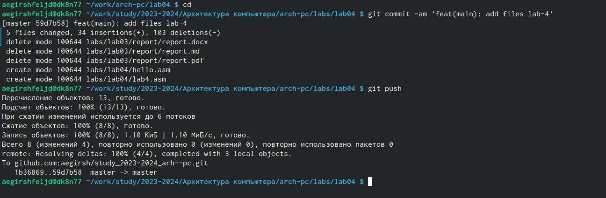

---
## Front matter
title: "Отчёт по лабораторной работе №5"
subtitle: "Простейший вариант"
author: "Гиршфельд Александр Евгеньевич"

## Generic otions
lang: ru-RU
toc-title: "Содержание"

## Bibliography
bibliography: bib/cite.bib
csl: pandoc/csl/gost-r-7-0-5-2008-numeric.csl

## Pdf output format
toc: true # Table of contents
toc-depth: 2
lof: true # List of figures
lot: true # List of tables
fontsize: 12pt
linestretch: 1.5
papersize: a4
documentclass: scrreprt
## I18n polyglossia
polyglossia-lang:
  name: russian
  options:
	- spelling=modern
	- babelshorthands=true
polyglossia-otherlangs:
  name: english
## I18n babel
babel-lang: russian
babel-otherlangs: english
## Fonts
mainfont: PT Serif
romanfont: PT Serif
sansfont: PT Sans
monofont: PT Mono
mainfontoptions: Ligatures=TeX
romanfontoptions: Ligatures=TeX
sansfontoptions: Ligatures=TeX,Scale=MatchLowercase
monofontoptions: Scale=MatchLowercase,Scale=0.9
## Biblatex
biblatex: true
biblio-style: "gost-numeric"
biblatexoptions:
  - parentracker=true
  - backend=biber
  - hyperref=auto
  - language=auto
  - autolang=other*
  - citestyle=gost-numeric
## Pandoc-crossref LaTeX customization
figureTitle: "Рис."
tableTitle: "Таблица"
listingTitle: "Листинг"
lofTitle: "Список иллюстраций"
lotTitle: "Список таблиц"
lolTitle: "Листинги"
## Misc options
indent: true
header-includes:
  - \usepackage{indentfirst}
  - \usepackage{float} # keep figures where there are in the text
  - \floatplacement{figure}{H} # keep figures where there are in the text
---

# Цель работы

Освоение сборки программ, написанных на NASM

# Выполнение лабораторной работы
Откроем нужную папку, создадим файл и откроем его в gedit (рис. [-@fig:001])

{ #fig:001 width=70% }

Запишем код на языке NASM в файл с помощью gedit (рис. [-@fig:002])

{ #fig:002 width=70% }

Протранслируем файл hello.asm и получим объектный файл hello.o (рис. [-@fig:003])

{ #fig:003 width=70% }

Далее мы получаем объектный файл obj.o (он будет в формате elf) и файл листинга list.lst. Затем скомпилируем наш исполняемый файл hello (рис. [-@fig:004])

{ #fig:004 width=70% }

Тут мы создаем исполняемый файл main из объектного файла obj.o. Делать этот файл будет то же, что и файл hello.(рис. [-@fig:005])

{ #fig:005 width=70% }

Запустим файл hello (рис. [-@fig:006])

{ #fig:006 width=70% }

задания для сомостоятельной работы

скопируем файл hello.asm как lab4 (рис. [-@fig:007])

{ #fig:007 width=70% }

я открыл файл внес изменения и создал объектный файл и затем скомпилировал в конце получилось то что хотели (рис. [-@fig:008])

{ #fig:008 width=70% }

загрузил файлы на github (рис. [-@fig:009])

{ #fig:009 width=70% }

# Выводы

были получены навыки по сборке кода, написанного с помощью NASM, в исполняющий файл

# Список литературы{.unnumbered}

::: {#refs}
:::
