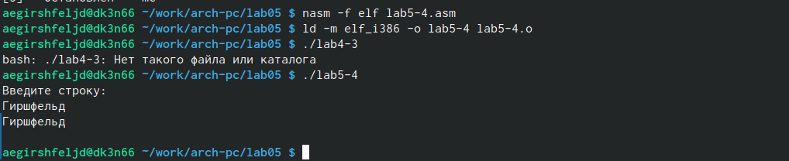

---
## Front matter
title: "отчёт по лабораторной работе5"
subtitle: "Дисциплина архитектура компьютера"
author: "Гиршфельд Александр Евгеньевич"

## Generic otions
lang: ru-RU
toc-title: "Содержание"

## Bibliography
bibliography: bib/cite.bib
csl: pandoc/csl/gost-r-7-0-5-2008-numeric.csl

## Pdf output format
toc: true # Table of contents
toc-depth: 2
lof: true # List of figures
lot: true # List of tables
fontsize: 12pt
linestretch: 1.5
papersize: a4
documentclass: scrreprt
## I18n polyglossia
polyglossia-lang:
  name: russian
  options:
	- spelling=modern
	- babelshorthands=true
polyglossia-otherlangs:
  name: english
## I18n babel
babel-lang: russian
babel-otherlangs: english
## Fonts
mainfont: PT Serif
romanfont: PT Serif
sansfont: PT Sans
monofont: PT Mono
mainfontoptions: Ligatures=TeX
romanfontoptions: Ligatures=TeX
sansfontoptions: Ligatures=TeX,Scale=MatchLowercase
monofontoptions: Scale=MatchLowercase,Scale=0.9
## Biblatex
biblatex: true
biblio-style: "gost-numeric"
biblatexoptions:
  - parentracker=true
  - backend=biber
  - hyperref=auto
  - language=auto
  - autolang=other*
  - citestyle=gost-numeric
## Pandoc-crossref LaTeX customization
figureTitle: "Рис."
tableTitle: "Таблица"
listingTitle: "Листинг"
lofTitle: "Список иллюстраций"
lotTitle: "Список таблиц"
lolTitle: "Листинги"
## Misc options
indent: true
header-includes:
  - \usepackage{indentfirst}
  - \usepackage{float} # keep figures where there are in the text
  - \floatplacement{figure}{H} # keep figures where there are in the text
---

# Цель работы

Целью является получение теоритических и практических навыков по работе с командами NASM mov и int и в midnigt comander.

# Выполнение лабораторной работы

зайдем в нужную папку сосдадим папку lab05 и сделаем там файл lab5-1.asm (рис. @fig:001).
{#fig:001 width=70%}

Далее напишем код нашей программы и создадим исполняемый файл и проверим его работу  (рис. @fig:002).
{#fig:002 width=70%}

Скопируем lab05.asm, изменим его с использование стороннего файла in_out.asm. Из полученного lab5-2.asm получим исполныемый файл lab5-2 (рис. @fig:003).
{#fig:003 width=70%}

Если мы изменим в коде программы команду sprintLF на sprint, то вводимые символы будут появляться в той же строке, что и “приглашение”.(рис. @fig:004).
{#fig:004 width=70%}

Задания для самостоятельного выполнения

Скопируем файл lab5-1.asm и добавим там блок кода, который будет выводить строку из нашего буффера.(рис. @fig:005) Этот файл назовем lab5-3.asm и сделаем из него исполняемый.
{#fig:005 width=70%}

проверим работу этого файла(рис. @fig:006)
{#fig:006 width=70%}

Скопируем файл lab5-2.asm и добавим там блок кода, который будет выводить строку из нашего буффера, но с использованием внешного файла in_out.asm(рис. @fig:007)
{#fig:007 width=70%}

запустим этот файл(рис. @fig:008)
{#fig:008 width=70%}

# Выводы

Были поняты основные механики работы языка ассемблера NASM: создание переменных и помещение данных в регистры.

# Список литературы{.unnumbered}

::: {#refs}
:::
