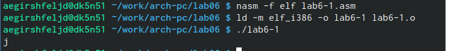

---
## Front matter
title: "Лабораторная работа 6"
author: "Гиршфельд Александр Евгеньевич"

## Generic otions
lang: ru-RU
toc-title: "Содержание"

## Bibliography
bibliography: bib/cite.bib
csl: pandoc/csl/gost-r-7-0-5-2008-numeric.csl

## Pdf output format
toc: true # Table of contents
toc-depth: 2
lof: true # List of figures
lot: true # List of tables
fontsize: 12pt
linestretch: 1.5
papersize: a4
documentclass: scrreprt
## I18n polyglossia
polyglossia-lang:
  name: russian
  options:
	- spelling=modern
	- babelshorthands=true
polyglossia-otherlangs:
  name: english
## I18n babel
babel-lang: russian
babel-otherlangs: english
## Fonts
mainfont: PT Serif
romanfont: PT Serif
sansfont: PT Sans
monofont: PT Mono
mainfontoptions: Ligatures=TeX
romanfontoptions: Ligatures=TeX
sansfontoptions: Ligatures=TeX,Scale=MatchLowercase
monofontoptions: Scale=MatchLowercase,Scale=0.9
## Biblatex
biblatex: true
biblio-style: "gost-numeric"
biblatexoptions:
  - parentracker=true
  - backend=biber
  - hyperref=auto
  - language=auto
  - autolang=other*
  - citestyle=gost-numeric
## Pandoc-crossref LaTeX customization
figureTitle: "Рис."
tableTitle: "Таблица"
listingTitle: "Листинг"
lofTitle: "Список иллюстраций"
lotTitle: "Список таблиц"
lolTitle: "Листинги"
## Misc options
indent: true
header-includes:
  - \usepackage{indentfirst}
  - \usepackage{float} # keep figures where there are in the text
  - \floatplacement{figure}{H} # keep figures where there are in the text
---

# Цель работы

Научиться производить математические операции посредствам языка программирования assembler.

# Выполнение лабораторной работы

Создадим нужный каталог и файл. Напишем текст программы в файл lab6-1.asm. Проассемблируем этот файл и запустим его. (рис. @fig:001).

{#fig:001 width=70%}

и вправду, получилось очень неожиданное значение. Исправим программу(рис. @fig:002)

{#fig:002 width=70%}

при замене строк на числа, выведется символ пререноса строки (рис. @fig:003)

{#fig:003 width=70%}

создадим файл lab6-2.asm, запишем туда код программы с использованием функций из файла in_out.asm, проассемблируем, запустим(рис. @fig:004)

{#fig:004 width=70%}

исправим программу следующим образом(рис. @fig:005)

{#fig:005 width=70%}

проверяем исправленую програму(рис. @fig:006)

{#fig:006 width=70%}

если изменить функцию iprintLF на iprint, то программа будет выводить ответ без символа переноса строки и приглашение bush'а появится сразу за 10.(рис. @fig:007)

{#fig:007 width=70%}

программа, выводящая решение f(x) = (5 * 2 + 3)/3 (рис. @fig:008) и ее работа (рис. @fig:009)

{#fig:008 width=70%}
{#fig:009 width=70%}

программа, выводящая решение f(x) = (4 * 6 + 2)/5 (рис. @fig:010) и ее работа (рис. @fig:011)

{#fig:010 width=70%}
{#fig:011 width=70%}

далее создадим файл, для выбора варианта, запишем туда код, проассемблируем его, исполним с номером студенческого(рис. @fig:012)

{#fig:012 width=70%}

ответы на вопросы

1. mov eax,rem
call sprint
2. данный код нужен для записи в переменную х вводимого из консоли значения
3. call atoi вызывает функцию, преобдразающую код символа в число
4. mov ebx,20
div ebx
inc edx
5. остаток будет в edx
6. увиличивает значение edx на 1
7.  mov eax,rem
call sprint
mov eax,edx
call iprintLF

Самостоятельная работа 

код программы(рис. @fig:013)

{#fig:013 width=70%}

работа програмы с заданами значениями(рис. @fig:014)
{#fig:014 width=70%}

# Выводы

Были получены навыки по выполнению арифметических операций через ассемблер.

